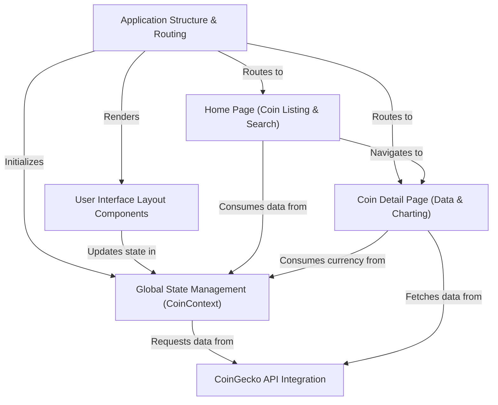

# Tutorial: CoinPulse

CoinPulse is a dynamic web application that provides a comprehensive overview of the **cryptocurrency market**. Users can explore a *list of various digital currencies*, view their current prices, and track 24-hour changes. It also features a *search functionality* to quickly find specific coins and offers detailed pages for each, including **historical price charts** and key market data, all while allowing users to select their preferred *display currency* (e.g., USD, EUR).

## Visual Overview

## Chapters

1. [CoinGecko API Integration](01_CoinGecko_API_Integration.md)
2. [Global State Management (CoinContext)](02_Global_State_Management_(CoinContext).md)
3. [Application Structure & Routing](03_Application_Structure_&_Routing.md)
4. [User Interface Layout Components](04_UI_Layout_Components.md)
5. [Home Page (Coin Listing & Search)](05_Home_Page_(Coin_Listing_&_Search).md)
6. [Coin Detail Page (Data & Charting)](06_Coin_Detail_Page_(Data_&_Charting).md)

---
