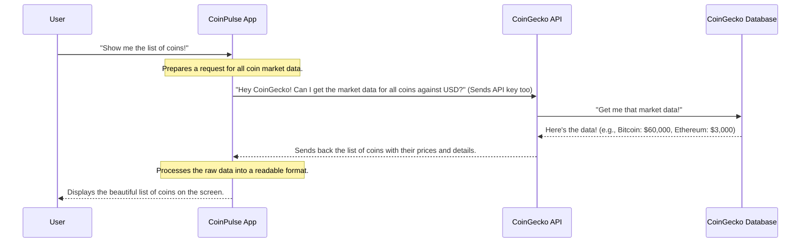

# Chapter 1: CoinGecko API Integration

Welcome to the first chapter of our `CoinPulse` tutorial! In this chapter, we're going to dive into a super important part of our application: how it gets all its cryptocurrency information. Think of it like our app's dedicated "data detective" – always out there, searching for the latest prices, trends, and details about all the coins.

### The Big Problem: Where Does Crypto Data Come From?

Imagine you open the `CoinPulse` app and see the current price of Bitcoin, how much it has changed today, or a graph showing its price over the last week. Where does all this information come from? It doesn't just appear out of thin air!

Our app needs to ask a reliable source for this data. This is exactly the problem that "CoinGecko API Integration" solves. It's the system responsible for going out to the internet, talking to a vast database of crypto information, and bringing back exactly what our app needs to show you.

### What is an API, and What is CoinGecko?

Before we look at the code, let's understand two key terms:

1.  **API (Application Programming Interface)**:
    Think of an API as a **waiter in a restaurant**. You (our `CoinPulse` app) want food (cryptocurrency data). You don't go into the kitchen yourself. Instead, you tell the waiter (the API) what you want. The waiter goes to the kitchen (a big online database), gets your order, and brings it back to your table. An API is just a set of rules and tools that allow different software programs to talk to each other and exchange information.

2.  **CoinGecko**:
    CoinGecko is one of the world's largest independent cryptocurrency data aggregators. In simpler terms, it's a huge website that collects, organizes, and provides tons of up-to-date information about almost every cryptocurrency imaginable – their prices, market cap, trading volumes, historical data, and much more. CoinGecko offers an API that allows other applications, like `CoinPulse`, to access all this rich data.

So, "CoinGecko API Integration" means our `CoinPulse` app knows how to "talk" to CoinGecko's database to fetch crypto information.

### How Our App "Talks" to CoinGecko

Let's walk through a common scenario: our `CoinPulse` app wants to display a list of the top cryptocurrencies with their current prices. Here's how the "conversation" happens:



As you can see, our app acts as the middleman, asking CoinGecko for data and then showing it to you.

### Looking at the Code: Fetching a List of All Coins

Let's look at a simplified version of the code that our `CoinPulse` app uses to fetch a list of all coins. This code lives in `src/context/CoinContext.jsx` and is responsible for getting the initial data for our home page.

```javascript
// src/context/CoinContext.jsx (simplified)
import { useEffect, useState } from "react";

const CoinContextProvider = (props) => {
    const [allCoin, setAllCoin] = useState([]); // Where we store the list of coins
    const [currency, setCurrency] = useState({ name: "usd", symbol: "$" }); // Our chosen currency

    const fetchAllCoin = async () => {
        const options = {
            method: 'GET', // We want to GET data
            headers: {
                accept: 'application/json',
                'x-cg-demo-api-key': 'CG-AZCxCEDF4JoSCFw9pKVtMX8G' // Our special access key!
            }
        };

        // This is the specific address (URL) on CoinGecko for market data
        const url = `https://api.coingecko.com/api/v3/coins/markets?vs_currency=${currency.name}`;

        // The 'fetch' command sends our request to CoinGecko!
        fetch(url, options)
            .then(res => res.json()) // Once CoinGecko replies, convert its raw reply into a readable format (JSON)
            .then(res => setAllCoin(res)) // Take the readable data and store it in our 'allCoin' list
            .catch(err => console.error(err)); // If something goes wrong, tell us about it
    }

    // This makes sure 'fetchAllCoin' runs when the app starts
    // and whenever our selected currency changes
    useEffect(() => {
        fetchAllCoin();
    }, [currency]);

    // ... other parts of our app's data management ...
};

export default CoinContextProvider;
```

**What's happening in this code?**

*   **`options`**: This is like a note we attach to our request. It tells CoinGecko *how* we want to get the data (`GET`) and provides our special `'x-cg-demo-api-key'`. This key is like a secret password that allows our app to access CoinGecko's data.
*   **`url`**: This is the exact web address where CoinGecko's API expects our request. The `?vs_currency=${currency.name}` part tells CoinGecko we want prices in our selected currency (like USD).
*   **`fetch(url, options)`**: This is the magical command! It sends our request, with our `url` and `options`, out to the internet to CoinGecko.
*   **`.then(res => res.json())`**: When CoinGecko sends its reply, it's often in a raw, technical format. This line quickly converts it into a more friendly JavaScript format (called JSON) that our app can easily understand.
*   **`.then(res => setAllCoin(res))`**: Once the data is readable, we use `setAllCoin` to save this list of coins into our app's `allCoin` variable. Now, other parts of the app can use this data!
*   **`useEffect(() => { ... }, [currency])`**: This is a React feature that ensures `fetchAllCoin` runs when the app first loads, and whenever the `currency` selection changes (e.g., from USD to EUR), so we always have the freshest data.

### Diving Deeper: Fetching Details for a Single Coin

Besides getting a list of all coins, our app also needs to fetch specific details for just one coin (like Bitcoin) when you click on it, or even its historical price data to draw a chart. This happens on the [Coin Detail Page (Data & Charting)](06_coin_detail_page__data___charting__.md).

Let's look at a simplified code snippet from `src/pages/Coin/Coin.jsx`:

```javascript
// src/pages/Coin/Coin.jsx (simplified)
import React, { useContext, useEffect, useState } from 'react';
import { useParams } from 'react-router-dom';
import { CoinContext } from '../../context/CoinContext'; // To get the current currency

const Coin = () => {
    const {coinId} = useParams(); // Gets the coin's ID from the web address (e.g., 'bitcoin')
    const [coinData, setCoinData] = useState(); // To store the details of one coin
    const [historicalData, setHistoricalData] = useState(); // To store data for the chart
    const {currency} = useContext(CoinContext); // Get the currently selected currency

    const fetchCoinData = async () => {
        const options = { /* same GET and API key options as before */ }; // Simplified for brevity

        // URL to get detailed info for a SPECIFIC coin
        const url = `https://api.coingecko.com/api/v3/coins/${coinId}`;
        fetch(url, options)
            .then(res => res.json())
            .then(res => setCoinData(res)) // Store the specific coin's details
            .catch(err => console.error(err));
    };

    const fetchHistoricalData = async () => {
        const options = { /* same GET and API key options as before */ }; // Simplified for brevity

        // URL to get historical prices for a SPECIFIC coin for charting
        const url = `https://api.coingecko.com/api/v3/coins/${coinId}/market_chart?vs_currency=${currency.name}&days=10&interval=daily`;
        fetch(url, options)
            .then(res => res.json())
            .then(res => setHistoricalData(res)) // Store the chart data
            .catch(err => console.error(err));
    };

    useEffect(() => {
        fetchCoinData(); // Fetch details when the page loads or currency/coin changes
        fetchHistoricalData(); // Fetch chart data as well
    }, [currency, coinId]); // Re-run if currency or the coin we're looking at changes

    if (coinData && historicalData) {
        return (
            <div className='coin'>
                {/* We use 'coinData' here to display the coin's image, name, current price */}
                
                <p><b>{coinData.name} ({coinData.symbol.toUpperCase()})</b></p>
                {/* ... and 'historicalData' to power our charts! */}
                {/* ... more UI code ... */}
            </div>
        );
    } else {
        return (
            <div className='spinner'>Loading...</div> // Show a loading message while waiting for data
        );
    }
};

export default Coin;
```

**Key takeaways from this code:**

*   **Targeted Requests**: Notice how the `url` for `fetchCoinData` and `fetchHistoricalData` includes `${coinId}`. This makes the request specific to the coin you're viewing (e.g., `.../coins/bitcoin` or `.../coins/ethereum`).
*   **Historical Data Parameters**: For charts, we need to specify more details, like `days=10` (for 10 days of data) and `interval=daily` (daily price points).
*   **`useEffect` for Freshness**: Just like before, `useEffect` ensures that whenever you navigate to a different coin or change the currency, our app fetches the *new* data for that coin immediately.
*   **Loading State**: Before the data arrives from CoinGecko, the `if (coinData && historicalData)` check helps display a "Loading..." message, so the user knows something is happening.

### Different CoinGecko Endpoints We Use

Our `CoinPulse` app interacts with the CoinGecko API using different "endpoints" depending on what kind of data it needs:

| What We Want                               | CoinGecko API Endpoint                                   | Where We Use It                                   |
| :----------------------------------------- | :------------------------------------------------------- | :------------------------------------------------ |
| List of all coins with market data         | `/api/v3/coins/markets`                                  | To show the big list of coins on the Home Page    |
| Detailed information for a single coin     | `/api/v3/coins/{coinId}`                                 | To display specific info on the Coin Detail Page  |
| Historical price data for a single coin    | `/api/v3/coins/{coinId}/market_chart`                    | To draw the price chart on the Coin Detail Page   |

Each endpoint is a unique address that returns a different type of information from CoinGecko.

### Conclusion

In this chapter, we've learned that "CoinGecko API Integration" is the foundation of our `CoinPulse` app. It's how our application communicates with the vast world of cryptocurrency data, acting as our app's "data retriever." We saw how `fetch` calls are used to send requests to the CoinGecko API, retrieve raw data, and make it available for our app to process and display.

Understanding this process is crucial, because all the amazing charts, prices, and coin details you see in the app depend on this data being successfully fetched.

Now that we know how to get the data, the next logical step is to understand how we *store* and *share* this data throughout our entire application without having to fetch it repeatedly. That's exactly what we'll cover in the next chapter: [Global State Management (CoinContext)](02_global_state_management__coincontext__.md).

---