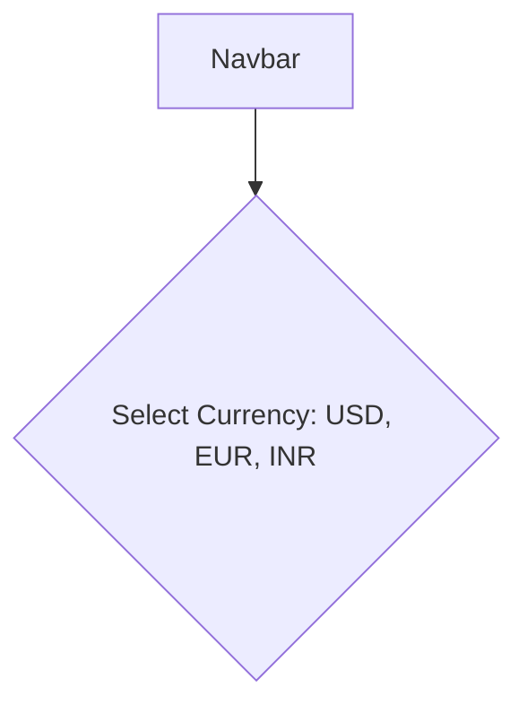
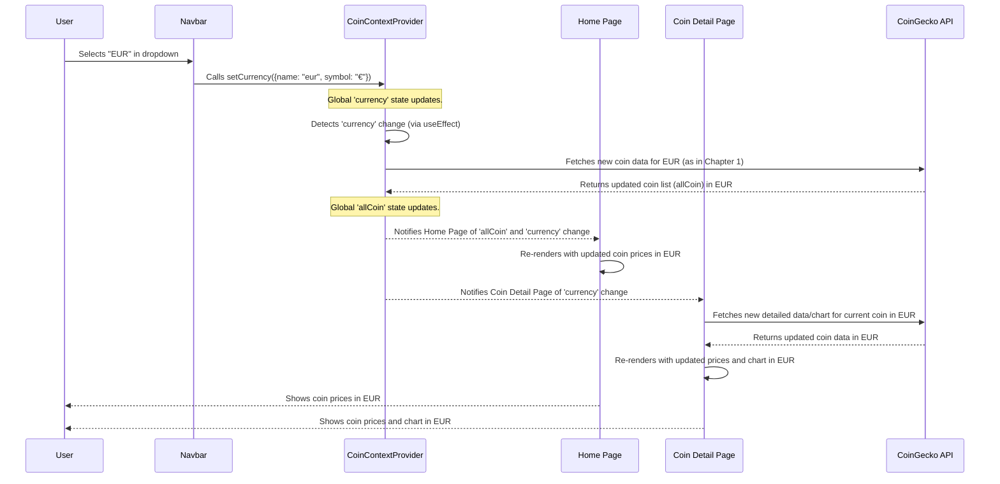

# Chapter 2: Global State Management (CoinContext)

Welcome back, future crypto developer! In the last chapter, [CoinGecko API Integration](01_coingecko_api_integration_.md), we learned how our `CoinPulse` app acts like a "data detective," fetching all the latest cryptocurrency information from the internet. We saw how we could get a list of all coins or detailed data for a specific coin.

Now, imagine our app has fetched all this wonderful data. How do we make sure *every part* of our application – from the top navigation bar to the coin list on the home page, and even the detailed coin page – can easily access this data without constantly asking the "data detective" again and again, or passing it around like a hot potato?

This is exactly the problem that **Global State Management (CoinContext)** solves.

### The Big Problem: Sharing Information Across the App

Let's use a simple example in `CoinPulse`. At the top of our app, in the Navbar, there's a dropdown menu where you can choose your preferred display currency: USD, EUR, or INR.



Imagine you're on the Home page, looking at Bitcoin's price in USD. You go to the Navbar, select "EUR". What should happen?

1.  The Bitcoin price on the Home page should immediately change to EUR.
2.  If you click on Bitcoin to go to its detailed page, its price and chart data should also be in EUR.
3.  Any other part of the app that shows prices should update.

How do we tell *all these different parts* of the app that the currency has changed? Without a central system, we'd have to:

*   Pass the currency choice from the Navbar, down through multiple components, to reach the Home page.
*   Then, pass it *again* to the Coin Detail page.
*   This quickly becomes a messy web of information passing!

This is where **Global State Management** comes in.

### What is Global State Management? (The Bulletin Board Analogy)

Think of our `CoinPulse` app as a bustling office building with many different departments (components like Navbar, Home page, Coin Detail page). Each department needs to know certain important information, like the current exchange rate or the list of available cryptocurrencies.

Instead of shouting this information across offices or sending countless emails, we set up a **central bulletin board**.

*   **The Bulletin Board (`CoinContext`)**: This is where all the crucial, app-wide information is posted.
*   **Posting Information (`setCurrency`, `setAllCoin`)**: One department (e.g., the Navbar) can write new information on the board (e.g., "Display currency is now EUR!").
*   **Reading Information (`currency`, `allCoin`)**: Any other department (e.g., Home page, Coin Detail page) can simply look at the board to get the latest information.
*   **Automatic Updates**: When information on the board changes, everyone who is "subscribed" to that part of the board automatically sees the update and reacts.

This "bulletin board" is our **global state**, and in React applications like `CoinPulse`, we manage it using something called the **Context API**.

### Key Concepts Behind CoinContext

Let's break down how React's Context API helps us build our `CoinContext` bulletin board.

1.  **`createContext()`: Creating the Bulletin Board**
    This is like setting up the empty bulletin board itself. We give it a name, `CoinContext`, so everyone knows where to look.

    ```javascript
    // src/context/CoinContext.jsx
    import { createContext } from "react";

    export const CoinContext = createContext(); // This line creates our bulletin board!
    ```

    *Explanation*: `createContext()` is a special React function that makes a new "context." Think of it as preparing a container that can hold shared data. We then `export` it so other parts of our app can refer to this specific context.

2.  **`CoinContextProvider`: The Bulletin Board Manager**
    This is the "person" in charge of the bulletin board. They decide what information goes on the board (`allCoin`, `currency`), how to update it, and makes sure anyone who needs the board can access it.

    ```javascript
    // src/context/CoinContext.jsx (simplified)
    import { createContext, useEffect, useState } from "react";

    export const CoinContext = createContext();

    const CoinContextProvider = (props) => {
        // Here, we decide what goes on the bulletin board:
        const [allCoin, setAllCoin] = useState([]); // List of coins
        const [currency, setCurrency] = useState({ name: "usd", symbol: "$" }); // Selected currency

        // This function fetches data (as seen in Chapter 1)
        const fetchAllCoin = async () => { /* ... API call logic ... */ };

        // This makes sure 'fetchAllCoin' runs when currency changes
        useEffect(() => {
            fetchAllCoin();
        }, [currency]); // React to changes in 'currency'

        // This is the actual data and functions we make available on the board:
        const contextValue = {
            allCoin,     // The list of coins
            currency,    // The selected currency
            setCurrency  // A way to change the selected currency
        };

        // This is how we "provide" the bulletin board to everyone inside:
        return (
            <CoinContext.Provider value={contextValue}>
                {props.children} {/* All the components that need to read the board */}
            </CoinContext.Provider>
        );
    };

    export default CoinContextProvider;
    ```

    *Explanation*:
    *   `useState` is used here to create pieces of "state" (`allCoin` and `currency`) that will live on our global bulletin board.
    *   `useEffect` is crucial: it tells our "manager" to *re-fetch all coin data* from CoinGecko whenever the `currency` on the board changes. This ensures prices are always in the correct currency.
    *   `contextValue` groups all the data and functions we want to share.
    *   `CoinContext.Provider` is the magical component. It takes a `value` prop (our `contextValue`) and makes that `value` accessible to *all* components rendered inside it (`props.children`).

3.  **Wrapping the App (`main.jsx`): Setting Up the Office Building**
    To make sure *all* our app's departments have access to the bulletin board, we need to place the `CoinContextProvider` around our entire application.

    ```javascript
    // src/main.jsx
    import { createRoot } from 'react-dom/client';
    import App from './App.jsx';
    import { BrowserRouter } from 'react-router-dom';
    import CoinContextProvider from './context/CoinContext.jsx'; // Our manager!

    createRoot(document.getElementById('root')).render(
        <BrowserRouter>
            {/* We wrap our entire App with the CoinContextProvider */}
            <CoinContextProvider>
                <App /> {/* Now, App and ALL its children can access the CoinContext */}
            </CoinContextProvider>
        </BrowserRouter>
    );
    ```

    *Explanation*: By wrapping `<App />` with `<CoinContextProvider>`, we're essentially saying, "Hey, `CoinContextProvider`, manage the global state for *everything inside* the `<App />` component."

4.  **`useContext()`: Reading and Writing on the Bulletin Board**
    Now, any component in our app can "look at" or "write on" the bulletin board using the `useContext` Hook.

    **Example: Navbar updating the currency**

    ```javascript
    // src/components/Navbar/Navbar.jsx (simplified)
    import React, { useContext } from 'react';
    import { CoinContext } from '../../context/CoinContext'; // Import our bulletin board

    const Navbar = () => {
        // We use useContext to get access to 'setCurrency' from the board!
        const { setCurrency } = useContext(CoinContext);

        const currencyHandler = (event) => {
            const selectedCurrency = event.target.value;
            const currencyMap = { /* ... mapping for usd, eur, inr ... */ };
            setCurrency(currencyMap[selectedCurrency]); // Update the global currency on the board!
        };

        return (
            <div className='navbar'>
                {/* ... other navbar elements ... */}
                <select onChange={currencyHandler}>
                    <option value="usd">USD</option>
                    <option value="eur">EURO</option>
                    {/* ... other options ... */}
                </select>
                {/* ... */}
            </div>
        );
    };

    export default Navbar;
    ```

    *Explanation*: The `Navbar` component uses `useContext(CoinContext)` to grab the `setCurrency` function that `CoinContextProvider` made available. When the user changes the dropdown, `currencyHandler` calls `setCurrency`, which updates the `currency` state on the global bulletin board.

    **Example: Home page reading coin data and currency**

    ```javascript
    // src/pages/Home/Home.jsx (simplified)
    import React, { useContext, useEffect, useState } from 'react';
    import { CoinContext } from '../../context/CoinContext'; // Import our bulletin board

    export const Home = () => {
        // We use useContext to get 'allCoin' and 'currency' from the board!
        const { allCoin, currency } = useContext(CoinContext);
        const [displayCoin, setDisplayCoin] = useState([]); // Local state for filtered coins

        useEffect(() => {
            setDisplayCoin(allCoin); // When global 'allCoin' changes, update our local display
        }, [allCoin]);

        return (
            <div className='home'>
                {/* ... hero section ... */}
                <div className='crypto-table'>
                    {displayCoin.slice(0, 15).map((item, index) => (
                        <div className='table-layout' key={index}>
                            {/* Display coin details using 'item' and the global 'currency.symbol' */}
                            <p>{item.market_cap_rank}</p>
                            <p>{currency.symbol} {item.current_price.toLocaleString()}</p>
                            {/* ... more coin details ... */}
                        </div>
                    ))}
                </div>
            </div>
        );
    };
    ```

    *Explanation*: The `Home` page also uses `useContext(CoinContext)` to get the `allCoin` list and the current `currency`. When `setCurrency` is called in the `Navbar`, the `CoinContextProvider` re-fetches data (as seen in `useEffect` within `CoinContextProvider`), updates `allCoin`, and then because `Home` is `useContext`ing `allCoin` and `currency`, it automatically re-renders with the new data and currency symbol!

### How Currency Changes Flow Through the App

Let's trace what happens when a user changes the currency:



As you can see, the `CoinContextProvider` acts as the central hub. When the `currency` is updated (even from a small component like `Navbar`), the provider ensures that all data dependent on that currency is refetched and that any component consuming that data (`Home` or `Coin` page) automatically receives the freshest information.

### Conclusion

In this chapter, we explored the vital concept of **Global State Management** using `CoinContext` in our `CoinPulse` app. We learned that instead of passing data through many layers of components, we can use a central "bulletin board" to store and share important information like the list of all cryptocurrencies and the currently selected display currency.

This approach ensures that when data changes in one part of the app (like changing the currency in the Navbar), all other relevant parts of the app automatically react and display the most up-to-date information, making our application efficient, consistent, and much easier to manage.

Now that we understand how data is fetched and shared, it's time to put it all together into a structured application. In the next chapter, [Application Structure & Routing](03_application_structure___routing__.md), we'll learn how to organize our app's different pages and components and navigate between them.

---
