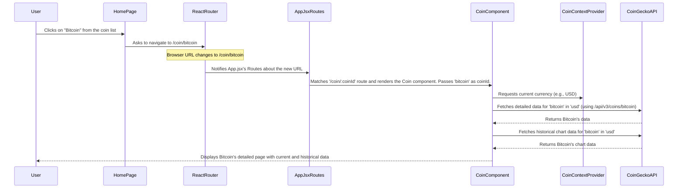

# Chapter 3: Application Structure & Routing

Welcome back, future crypto developer! In the last chapter, [Global State Management (CoinContext)](02_global_state_management__coincontext__.md), we learned how to store and share important data like our list of cryptocurrencies and the selected currency across our entire application. This ensures that every part of our app can access the latest information.

Now, let's talk about how we organize our app into different "screens" or "pages" and how users move between them. Imagine our `CoinPulse` app as a house: it needs rooms (pages) and hallways (navigation) to connect them, all while having a consistent exterior (like a roof and foundation). This is where **Application Structure & Routing** comes in.

### The Big Problem: Organizing Pages and Moving Between Them

Think about using any website or app. You usually see a consistent header at the top and maybe a footer at the bottom, no matter which page you're on. In between, the main content changes.

For our `CoinPulse` app, we need:

1.  A **Home Page** to display a list of all cryptocurrencies.
2.  A **Coin Detail Page** to show detailed information and a chart for a *specific* cryptocurrency (like Bitcoin or Ethereum) when a user clicks on it.

How do we achieve this?

*   How do we make sure our `Navbar` (header) and `Footer` are always visible, while only the *middle section* changes?
*   How does the app know to show the "Home" content when you go to `yourwebsite.com` and the "Bitcoin Detail" content when you go to `yourwebsite.com/coin/bitcoin`?
*   And how do we make it so that when a user clicks on a coin in the list, they are magically taken to *that specific coin's* detail page?

This is exactly what **Application Structure & Routing** solves. It's the foundational framework that organizes the entire user experience by defining the overall layout and managing navigation.

### What is Application Structure and Routing? (The House Analogy)

Let's stick with our house analogy to understand these concepts:

1.  **Application Structure**:
    Imagine your `CoinPulse` app is a house. The "Application Structure" is the **architectural blueprint**.
    *   It defines that every room will have a **consistent roof** (our `Navbar`) and a **solid foundation** (our `Footer`). These parts are always there, no matter which room you're in.
    *   The walls, furniture, and decor **inside each room** (our different pages like Home or Coin Detail) are unique and change depending on which room you enter.

2.  **Routing**:
    This is like the **hallway system, doors, and signposts** within our house.
    *   You walk to the main entrance (the default `/` address) and you enter the living room (the Home page).
    *   You open a specific door labeled "Master Bedroom" (the `/coin/bitcoin` address) and you're taken to a room with unique details for Bitcoin (the Coin Detail page).
    *   Routing is the system that matches a specific "address" (URL in your browser) to the correct "room" (component or page) in our application.

### Our Tool: `react-router-dom`

In React applications like `CoinPulse`, we use a popular library called `react-router-dom` to handle all our routing needs. It provides the tools to define our house's structure and navigate its hallways.

### Implementing Our Application Structure & Routing

Let's see how we use `react-router-dom` to build our app's structure and manage navigation.

#### 1. Setting Up the Router (The House's Foundation)

First, we need to tell our entire application that it lives in a world where addresses (URLs) matter. We do this by wrapping our main `App` component with `BrowserRouter` in `src/main.jsx`.

```javascript
// src/main.jsx
import { StrictMode } from 'react';
import { createRoot } from 'react-dom/client';
import './index.css';
import App from './App.jsx';
import { BrowserRouter } from 'react-router-dom'; // Import BrowserRouter
import CoinContextProvider from './context/CoinContext.jsx';

createRoot(document.getElementById('root')).render(
  <StrictMode>
    <BrowserRouter> {/* Our entire app now understands web addresses */}
      <CoinContextProvider>
        <App /> {/* Our main application component */}
      </CoinContextProvider>
    </BrowserRouter>
  </StrictMode>,
);
```

**What's happening here?**
*   `BrowserRouter` is a component from `react-router-dom`. By wrapping our entire `<App />` with it, we enable our application to listen to changes in the web browser's URL and make routing possible for all the components inside it. Think of it as installing the "address-reading" system for our whole house.
*   We also keep `CoinContextProvider` inside `BrowserRouter` so that global state is available across all routes.

#### 2. Defining Routes (The Rooms and Their Addresses)

Next, inside our main `App` component (`src/App.jsx`), we define our application's structure and tell `react-router-dom` which "rooms" (pages) correspond to which "addresses" (URLs).

```javascript
// src/App.jsx
import React from 'react';
import Navbar from './components/Navbar/Navbar';
import { Routes, Route } from 'react-router-dom'; // Import Routes and Route
import { Home } from './pages/Home/Home';
import Coin from './pages/Coin/Coin';
import Footer from './components/Footer/Footer';

const App = () => {
  return (
    <div className='app'>
      <Navbar/> {/* This Navbar is always visible */}
      <Routes> {/* This is like the main directory for our 'rooms' */}
        <Route path='/' element={<Home/>}/> {/* When address is '/', show the Home page */}
        <Route path='/coin/:coinId' element={<Coin/>}/> {/* For /coin/bitcoin, show Coin page */}
      </Routes>
      <Footer/> {/* This Footer is also always visible */}
    </div>
  );
}

export default App;
```

**What's happening here?**

*   **Consistent Structure**: Notice that `<Navbar/>` and `<Footer/>` are placed *outside* the `<Routes>` component. This means they will always be displayed, no matter which route is active. This creates our consistent "roof" and "foundation" for the app.
*   **`<Routes>`**: This component acts as the main container for all our individual routes. It looks at the current browser URL and finds the best matching `<Route>`.
*   **`<Route>`**: Each `<Route>` component defines a specific path and the React component (`element`) that should be rendered when that path is active.
    *   `path='/'`: This is our application's home address. When the URL is simply `yourwebsite.com/`, `react-router-dom` will render the `<Home/>` component.
    *   `path='/coin/:coinId'`: This is a special and very powerful route!
        *   It means "match any URL that starts with `/coin/` followed by *anything else*."
        *   The `:coinId` part is a **dynamic parameter**. It tells `react-router-dom` to capture whatever comes after `/coin/` (e.g., "bitcoin", "ethereum", "dogecoin") and make it available to the `Coin` component. This allows us to have a single `Coin` component that can display details for *any* coin, based on the URL.

#### 3. Navigating and Reading Dynamic URLs

Now that we've defined our paths, how do users actually move between them, and how does a page know *which* dynamic information it's supposed to show?

**A. Navigating from the Home Page (Going to a Coin's Detail Page)**

On the [Home Page (Coin Listing & Search)](05_home_page__coin_listing___search__.md), when a user clicks on a specific cryptocurrency, our app needs to navigate to its detail page. While `react-router-dom` offers a `<Link>` component for navigation, in our app, we often use a `useNavigate` hook for more programmatic control. The core idea is the same: tell the router to change the URL.

For example, if you click on Bitcoin from the list, the app will programmatically change the URL in your browser to something like `yourwebsite.com/coin/bitcoin`.

**B. Reading the Dynamic URL (Knowing Which Coin to Show)**

Once we've landed on a URL like `/coin/bitcoin`, our `Coin` component needs to know that `coinId` is "bitcoin" so it can fetch the correct data from the [CoinGecko API Integration](01_coingecko_api_integration_.md). This is where the `useParams` hook comes in.

```javascript
// src/pages/Coin/Coin.jsx (simplified)
import React, { useContext, useEffect, useState } from 'react';
import { useParams } from 'react-router-dom'; // Import useParams
import { CoinContext } from '../../context/CoinContext';

const Coin = () => {
    // This grabs the dynamic part of the URL!
    // If URL is /coin/bitcoin, then coinId will be 'bitcoin'.
    const {coinId} = useParams();
    const [coinData, setCoinData] = useState();
    const {currency} = useContext(CoinContext);

    // This function will now use 'coinId' to fetch specific data
    const fetchCoinData = async () => {
        // ... API call logic from Chapter 1, using coinId in the URL ...
        const url = `https://api.coingecko.com/api/v3/coins/${coinId}`;
        // ...
    };

    useEffect(() => {
        fetchCoinData();
        // ... fetch historical data ...
    }, [currency, coinId]); // Re-run if currency or the coin we're looking at changes

    // ... display UI using coinData ...
    if (coinData) {
        return (
            <div className='coin'>
                
                <p><b>{coinData.name} ({coinData.symbol.toUpperCase()})</b></p>
                {/* ... display other coin details using coinData ... */}
            </div>
        );
    } else {
        return <div className='spinner'>Loading...</div>;
    }
};

export default Coin;
```

**What's happening here?**

*   `useParams()`: This is a special React hook provided by `react-router-dom`. When called inside a component rendered by a dynamic route (like `/coin/:coinId`), it returns an object containing the dynamic parts of the URL. So, if the URL is `/coin/bitcoin`, `useParams()` will give us `{ coinId: 'bitcoin' }`.
*   `const {coinId} = useParams();`: We use "object destructuring" to easily extract the `coinId` value.
*   The `Coin` component then uses this `coinId` to make targeted API requests (as we saw in [Chapter 1: CoinGecko API Integration](01_coingecko_api_integration_.md)) to fetch the correct data for that specific coin.

### How Navigation Flows Through the App (A Quick Tour)

Let's trace what happens when a user clicks on Bitcoin on the Home page to view its details:



### Conclusion

In this chapter, we've laid the groundwork for how our `CoinPulse` app is organized and how users move through it. We learned about:

*   **Application Structure**: How a consistent `Navbar` and `Footer` provide a unified look, while the main content area changes.
*   **Routing**: How `react-router-dom` helps us define different "pages" for our app, matching specific URLs to specific components.
*   **Dynamic Routing**: How we use parameters like `:coinId` to create flexible routes that can display different content based on the URL (e.g., a detail page for *any* coin).
*   **`useParams`**: How components can read information directly from the URL to fetch the right data.

Understanding this structure is crucial because it dictates how our app feels and functions. Now that we know how to define our app's pages and navigate between them, we can start thinking about the visual appeal of these consistent elements like the Navbar and Footer. In the next chapter, [User Interface Layout Components](04_user_interface_layout_components_.md), we'll dive into building these essential parts of our user interface.

---