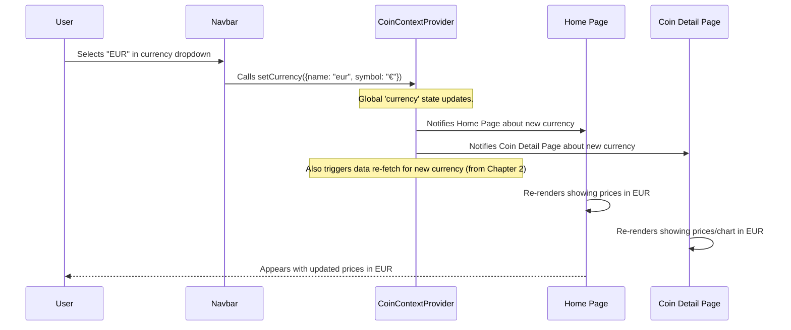

# Chapter 4: User Interface Layout Components

Welcome back, future crypto developer! In the last chapter, [Application Structure & Routing](03_application_structure___routing_.md), we learned how to organize our `CoinPulse` app into different pages and navigate between them. We set up our app like a house with different "rooms" (pages) and "hallways" (routes).

Now, let's talk about the parts of our app that *don't change* when you move from room to room. Think about a house: it has a roof and a foundation that are always there, no matter which room you're in. Similarly, our `CoinPulse` app needs consistent elements that appear on every page to provide a unified look and feel. This is where **User Interface Layout Components** come in.

### The Big Problem: Ensuring a Consistent Look and Feel

Imagine going to a website where the main navigation menu appears in a different place on every page, or the copyright information jumps around. It would be confusing and make the app feel unprofessional.

For `CoinPulse`, we need:

1.  A **Navbar** (short for Navigation Bar) at the top, which always shows our app's logo, navigation links (like "Home"), and essential controls (like the currency selector).
2.  A **Footer** at the bottom, which consistently displays copyright information and developer details.

How do we make sure these elements are *always* there, while only the main content area changes, just like we discussed in the "consistent structure" part of [Chapter 3](03_application_structure___routing_.md)?

This is the problem that **User Interface Layout Components** solve. They are the standard, reusable visual elements that create a consistent "frame" for our application, enhancing user familiarity and ease of use.

### What are Layout Components? (The Newspaper Analogy)

Think of a newspaper. Every edition has:

*   A **Masthead** at the very top: This shows the newspaper's name, logo, and sometimes the date. It's always there, always looks the same.
*   A **Footer** at the very bottom: This might have contact information, publication details, or copyright. It's also consistent.
*   The **Main Content**: The articles, headlines, and pictures, which change daily.

In `CoinPulse`:

*   Our **Navbar** is like the newspaper's masthead. It's at the top, has our logo, and crucial navigation links.
*   Our **Footer** is like the newspaper's footer. It's at the bottom and provides consistent information.
*   The "Main Content" in between the Navbar and Footer changes based on which page you're on (e.g., the coin list on the Home page, or a chart on the Coin Detail page).

### How We Implement Layout Components in `CoinPulse`

We've already seen a glimpse of this in [Chapter 3: Application Structure & Routing](03_application_structure___routing_.md). The trick is in how we arrange our components in `src/App.jsx`.

```javascript
// src/App.jsx (simplified)
import React from 'react';
import Navbar from './components/Navbar/Navbar'; // Our top layout component
import { Routes, Route } from 'react-router-dom';
import { Home } from './pages/Home/Home';
import Coin from './pages/Coin/Coin';
import Footer from './components/Footer/Footer'; // Our bottom layout component

const App = () => {
  return (
    <div className='app'>
      <Navbar/> {/* This Navbar is always visible */}
      <Routes> {/* The content INSIDE Routes changes based on the URL */}
        <Route path='/' element={<Home/>}/>
        <Route path='/coin/:coinId' element={<Coin/>}/>
      </Routes>
      <Footer/> {/* This Footer is also always visible */}
    </div>
  );
}

export default App;
```

**What's happening here?**

*   By placing `<Navbar/>` and `<Footer/>` *outside* the `<Routes>` component, we ensure that they are rendered *before* and *after* whatever content `react-router-dom` decides to display for the current URL.
*   `react-router-dom` (our "hallway system") only swaps out the components *inside* `<Routes>` (our "rooms"). The `Navbar` and `Footer` stay put, acting as the consistent frame around our dynamic content.

Let's look closer at each of these key layout components.

### The Navbar: Our Application's Command Center

The `Navbar` (`src/components/Navbar/Navbar.jsx`) is more than just a header; it's a vital interactive component.

#### Purpose:
*   **Branding**: Displays the `CoinPulse` logo and name.
*   **Navigation**: Provides links to different parts of the application (e.g., Home).
*   **Controls**: Allows users to select their preferred display currency (USD, EUR, INR).
*   **User Actions**: Includes a "Sign Up" button.

#### Simplified Code:
```javascript
// src/components/Navbar/Navbar.jsx (simplified)
import React, { useContext } from 'react';
import { Link } from 'react-router-dom';
import { CoinContext } from '../../context/CoinContext'; // To change currency
import logo from '../../assets/logo.png'; // Our app's logo
import './Navbar.css'; // Styling for the Navbar

const Navbar = () => {
    const { setCurrency } = useContext(CoinContext); // Get function to update currency

    // Function to handle when a user selects a new currency
    const currencyHandler = (event) => {
        const selectedValue = event.target.value; // e.g., "usd", "eur"
        if (selectedValue === "usd") setCurrency({ name: "usd", symbol: "$" });
        else if (selectedValue === "eur") setCurrency({ name: "eur", symbol: "€" });
        else if (selectedValue === "inr") setCurrency({ name: "inr", symbol: "₹" });
    };

    return (
        <div className='navbar'>
            {/* Logo and App Name, links to Home page */}
            <Link to={'/'} className="brand">
                
                <span>CoinPulse</span>
            </Link>

            {/* Navigation Links */}
            <ul>
                <Link to={'/'}><li>Home</li></Link>
                <li>Features</li> {/* Static links for now */}
                <li>Pricing</li>
            </ul>

            {/* Currency Selector and Sign Up Button */}
            <div className="nav-right">
                <select onChange={currencyHandler}> {/* When selection changes, call currencyHandler */}
                    <option value="usd">USD</option>
                    <option value="eur">EURO</option>
                    <option value="inr">INR</option>
                </select>
                <button>Sign Up</button>
            </div>
        </div>
    );
};

export default Navbar;
```

**What's happening in this code?**

*   **`<Link to={'/'}>`**: This component from `react-router-dom` is similar to a standard `<a>` tag, but it allows for "single-page application" navigation without fully reloading the page. Clicking the logo or "Home" link will take the user to the Home page.
*   **`useContext(CoinContext)`**: As we learned in [Chapter 2: Global State Management (CoinContext)](02_global_state_management__coincontext__.md), this hook allows the `Navbar` to access the `setCurrency` function from our global state.
*   **`currencyHandler`**: When you select a currency from the dropdown menu, this function is called. It then uses `setCurrency` to update the global `currency` state. This change will automatically trigger a re-fetch of coin data in the new currency, updating prices across the app!
*   **Styling**: The `Navbar.css` file contains all the rules to make the Navbar look sleek, with a glassmorphism effect and responsive design for different screen sizes.

#### Navbar Interaction Flow (Currency Change):


This diagram shows that when the Navbar updates the global currency, the components that depend on this global state (like the Home and Coin Detail pages) automatically react and update their display, thanks to [Global State Management (CoinContext)](02_global_state_management__coincontext__.md).

### The Footer: Application Information

The `Footer` (`src/components/Footer/Footer.jsx`) is found at the very bottom of every page.

#### Purpose:
*   **Copyright**: Displays copyright information for the application.
*   **Developer Credits**: Provides details about the developer.
*   **Social Links**: Includes links to the developer's social media or portfolio.

#### Simplified Code:
```javascript
// src/components/Footer/Footer.jsx (simplified)
import React from "react";
import "./Footer.css"; // Styling for the Footer
import { FaInstagram, FaLinkedin } from "react-icons/fa"; // Icons

const Footer = () => {
  return (
    <div className="footer">
      <p>Copyright © 2024 - CoinPulse - All rights Reserved</p>

      {/* Developer Info and Social Links */}
      <div className="developer-info">
        <p>Developed by Mahesh Pagrut</p>
        <div className="social-links">
          {/* Example social links (simplified) */}
          <a href="#"><FaInstagram className="social-icon" /></a>
          <a href="#"><FaLinkedin className="social-icon" /></a>
        </div>
      </div>
    </div>
  );
};

export default Footer;
```

**What's happening in this code?**

*   **`div` structure**: The footer is a simple React component that renders static text and links within a `div`.
*   **Icons**: We use icons from the `react-icons` library (like `FaInstagram` for Instagram) to make the social links visually appealing.
*   **Styling**: `Footer.css` ensures the footer is centered, styled appropriately, and always positioned at the bottom of the page content, regardless of the screen size.

### Conclusion

In this chapter, we've explored the importance of **User Interface Layout Components** in building a professional and user-friendly application. We focused on the `Navbar` and `Footer` as key examples of reusable components that provide a consistent "frame" for our `CoinPulse` app. We saw how their strategic placement in `src/App.jsx` ensures they are always visible, while the content in between changes with routing. We also revisited how the Navbar interacts with [Global State Management (CoinContext)](02_global_state_management__coincontext__.md) to update app-wide settings like the display currency.

Now that our application has a solid structure and a consistent look, it's time to build the core content! In the next chapter, [Home Page (Coin Listing & Search)](05_home_page__coin_listing___search__.md), we'll focus on creating the main page where users can view a list of cryptocurrencies and search for specific ones.

---