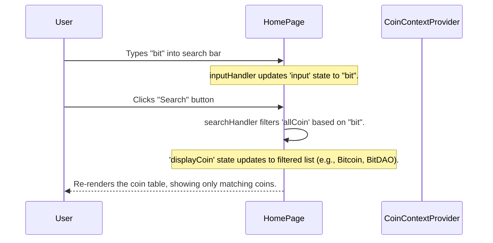
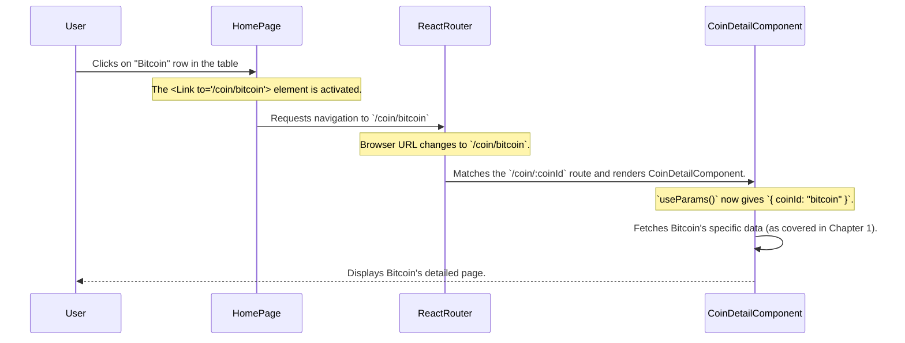

# Chapter 5: Home Page (Coin Listing & Search)

Welcome back, future crypto developer! In our last chapter, [User Interface Layout Components](04_user_interface_layout_components_.md), we put the "frame" around our `CoinPulse` application – the `Navbar` and `Footer` that stay consistent across all pages. Now that our app has a beautiful and functional structure, it's time to fill it with content!

This chapter is all about building the very first thing users see and interact with: the **Home Page**.

### The Big Problem: Showing the Crypto World at a Glance

Imagine opening a cryptocurrency app. What do you expect to see immediately? Probably a quick overview of the market, a list of popular coins, their prices, and perhaps how much they've changed. And if you're looking for a specific coin, you'd want a way to find it quickly.

This is the problem our **Home Page (Coin Listing & Search)** solves. It's designed to be the application's welcoming "lobby," providing:

1.  **A Market Overview**: A list of top cryptocurrencies with their essential details.
2.  **Current Prices**: Up-to-date price information in your chosen currency.
3.  **Quick Search**: A way to find any specific coin you're interested in.
4.  **Navigation**: An easy path to dive deeper into a coin's details.

Without a well-designed home page, users would feel lost or overwhelmed. It's the central hub for exploration!

### What is the Home Page? (The Bustling Market Square Analogy)

Think of the `CoinPulse` Home Page like a vibrant, digital **Market Square** for cryptocurrencies.

*   **The Entrance (`hero` section)**: When you first arrive, you see a welcoming message, like a large sign.
*   **The Bulletin Board (`crypto-table`)**: Right in the middle, there's a big board (our table) displaying all the top vendors (coins) and their current prices. You can quickly see who's doing well and who's not.
*   **The Information Booth (`search form`)**: If you're looking for a specific vendor, there's a helpful information booth (our search bar) where you can type their name to find them instantly.
*   **Pathways (`Link` components)**: Each vendor's listing on the bulletin board is also a clickable path. If you want to know more about a specific vendor, you can click on their name, and you're immediately taken to their dedicated shop (the Coin Detail Page).

### Key Ingredients of Our Home Page

Our Home Page (`src/pages/Home/Home.jsx`) combines several concepts we've learned already:

1.  **Getting the Coin Data**: We use [Global State Management (CoinContext)](02_global_state_management__coincontext__.md) to access the `allCoin` list and the user's `currency` choice, which comes from [CoinGecko API Integration](01_coingecko_api_integration_.md).
2.  **Displaying the Market Overview**: We render this `allCoin` data into a clear, sortable table.
3.  **The Search Bar**: We add an input field and some logic to filter the `allCoin` list based on what the user types.
4.  **Navigating to Coin Details**: We use `react-router-dom`'s `Link` component to make each coin in the list clickable, leading to its specific detail page, as set up in [Application Structure & Routing](03_application_structure___routing__.md).

Let's dive into the code!

### Code Walkthrough: Building the Home Page

Open up `src/pages/Home/Home.jsx`.

#### 1. Importing What We Need

```javascript
// src/pages/Home/Home.jsx (simplified imports)
import React, { useContext, useEffect, useState } from 'react';
import './Home.css'; // For styling our Home page
import { CoinContext } from '../../context/CoinContext'; // To get global coin data
import { Link } from 'react-router-dom'; // For navigation to coin detail pages
```

*   **`useContext`, `useEffect`, `useState`**: These are React tools for managing data and side effects within our component.
*   **`CoinContext`**: This is our "global bulletin board" (from [Chapter 2](02_global_state_management__coincontext__.md)) where our fetched coin data (`allCoin`) and current `currency` are stored.
*   **`Link`**: This `react-router-dom` component lets us create navigation links within our app without full page reloads.

#### 2. Accessing Global Data and Setting Up Local State

```javascript
// src/pages/Home/Home.jsx (inside Home component, simplified)
export const Home = () => {
    // 1. Get global coin data and currency from CoinContext
    const { allCoin, currency } = useContext(CoinContext);

    // 2. Local state to manage which coins are currently displayed (e.g., after search)
    const [displayCoin, setDisplayCoin] = useState([]);

    // 3. Local state for what the user types in the search bar
    const [input, setInput] = useState("");

    // 4. When 'allCoin' (global data) changes, update our 'displayCoin'
    useEffect(() => {
        setDisplayCoin(allCoin);
    }, [allCoin]);

    // ... rest of the component ...
};
```

*   **`useContext(CoinContext)`**: This is how our `Home` page "reads" the information from our global bulletin board. It gets the full list of coins (`allCoin`) and the selected `currency` (like `{ name: "usd", symbol: "$" }`).
*   **`useState([])` for `displayCoin`**: This is a local variable that will hold the list of coins *currently shown* on the screen. Initially, it's empty. It will be updated either by the full `allCoin` list or by the results of a search.
*   **`useState("")` for `input`**: This holds the text that the user types into the search bar.
*   **`useEffect(() => { ... }, [allCoin])`**: This React hook runs a function whenever `allCoin` changes. It ensures that `displayCoin` is always updated with the latest `allCoin` data from our `CoinContext`, especially after a currency switch or initial data fetch.

#### 3. Handling Search Input

```javascript
// src/pages/Home/Home.jsx (inside Home component, simplified)
    // ... previous code ...

    const inputHandler = (event) => {
        setInput(event.target.value); // Update 'input' state as user types
        if (event.target.value === "") {
            setDisplayCoin(allCoin); // If search bar is empty, show all coins again
        }
    };

    const searchHandler = async (event) => {
        event.preventDefault(); // Prevent page refresh on form submission

        // Filter the 'allCoin' list based on the user's input
        const filteredCoins = await allCoin.filter((item) => {
            return item.name.toLowerCase().includes(input.toLowerCase());
        });
        setDisplayCoin(filteredCoins); // Update 'displayCoin' with search results
    };

    // ... rest of the component ...
```

*   **`inputHandler`**: This function is called every time the user types something in the search input field.
    *   `setInput(event.target.value)`: It updates our `input` state with what the user typed.
    *   `if (event.target.value === "")`: If the user deletes all text from the search bar, we reset `displayCoin` to show *all* coins again.
*   **`searchHandler`**: This function is called when the user clicks the "Search" button or presses Enter.
    *   `event.preventDefault()`: Stops the browser from reloading the page, which is the default behavior for form submissions.
    *   `allCoin.filter(...)`: This is where the magic happens! It creates a new list (`filteredCoins`) containing only the coins whose names include the text typed in the `input` field (case-insensitive).
    *   `setDisplayCoin(filteredCoins)`: Updates our `displayCoin` state, causing the table to re-render with only the matching coins.

#### 4. The User Interface (JSX)

The `return` statement of our `Home` component defines what the user sees. It's structured into a "hero" section and a "crypto-table."

```javascript
// src/pages/Home/Home.jsx (simplified return statement)
  return (
    <div className='home'>
        <div className='hero'>
            <h1>Largest <br/>Crypto Marketplace</h1>
            <p>Welcome to the world's largest cryptocurrency marketplace...</p>

            <form onSubmit={searchHandler}>
                <input
                    onChange={inputHandler}
                    list='coinlist' // Connects to the datalist for suggestions
                    value={input}
                    type="text"
                    placeholder='Search crypto...'
                    required
                />
                <datalist id="coinlist"> {/* Provides suggestions based on 'allCoin' */}
                    {allCoin.map((item, index) => (<option key={index} value={item.name}/>))}
                </datalist>
                <button type='submit'>Search</button>
            </form>
        </div>

        <div className='crypto-table'>
            <div className='table-layout'> {/* Table Header */}
                <p>#</p><p>Coins</p><p>Price</p><p style={{textAlign:"center"}}>24H Change</p>
                <p  style={{textAlign:"right"}} className='market-cap'>Market Cap</p>
            </div>
            {/* Displaying the coins */}
            {
                displayCoin.slice(0,15).map((item, index) =>( // Show top 15 coins or filtered
                    <Link to={`/coin/${item.id}`} className='table-layout' key={index}>
                        <p>{item.market_cap_rank}</p>
                        <div>
                            
                            <p>{item.name + " - " + item.symbol}</p>
                        </div>
                        <p>{currency.symbol} {item.current_price.toLocaleString()}</p>
                        <p className={item.price_change_percentage_24h > 0 ? "green" : "red"}>
                            {Math.floor(item.price_change_percentage_24h * 100) / 100}%</p>
                        <p className='market-cap'>{currency.symbol} {item.market_cap.toLocaleString()}</p>
                    </Link>
                ))
            }
        </div>
    </div>
  );
}
```

*   **`hero` section**: Contains the welcoming text and the search form.
*   **`<form onSubmit={searchHandler}>`**: When this form is submitted, `searchHandler` is called.
*   **`<input onChange={inputHandler} ... />`**: This is our search input field. `onChange` ensures `inputHandler` updates the `input` state as the user types.
*   **`<datalist id="coinlist">`**: This provides suggestions to the search input. It dynamically generates `<option>` tags using `allCoin.map()`, so as you type, your browser might suggest coin names.
*   **`crypto-table`**: This section displays the actual list of coins.
*   **`table-layout` (header)**: Defines the column headers for our coin list.
*   **`displayCoin.slice(0,15).map(...)`**: This is the core of displaying our coins.
    *   `slice(0,15)`: We only display the first 15 coins from `displayCoin` (either the full list or the search results) to keep the initial view manageable.
    *   `.map()`: For each `item` (a coin object) in `displayCoin`, it creates a `Link` component, which acts as a clickable row in our table.
*   **`<Link to={`/coin/${item.id}`} ...>`**: This is crucial for navigation.
    *   `item.id`: Each coin has a unique ID (like "bitcoin", "ethereum").
    *   `to={`/coin/${item.id}`}`: When a user clicks on a coin row, `react-router-dom` will navigate them to a URL like `/coin/bitcoin`. This URL is then handled by the dynamic route we set up in [Chapter 3: Application Structure & Routing](03_application_structure___routing__.md).
*   **Displaying Data**: Inside each `Link`, we show the coin's rank, image, name, symbol, current price (formatted using `toLocaleString()` and `currency.symbol` from `CoinContext`), 24-hour change (colored green or red based on positive/negative change), and market cap.

#### 5. Styling with `Home.css`

The `src/pages/Home/Home.css` file contains all the styling rules to make our Home Page look great, with responsive design for different screen sizes and the glassmorphism effect. For example, it styles the hero section, the search bar, the coin table, and the green/red price change indicators.

### How It All Connects: User Interactions

Let's trace a couple of common user interactions on the Home Page:

#### 1. Searching for a Coin



#### 2. Clicking a Coin to See Details



As you can see, the Home Page acts as a hub, utilizing `CoinContext` for data, local state for user interactions (like search), and `react-router-dom` for seamless navigation.

### Conclusion

In this chapter, we brought our `CoinPulse` application to life by building its **Home Page (Coin Listing & Search)**. We learned how to:

*   Access global cryptocurrency data and currency settings using [Global State Management (CoinContext)](02_global_state_management__coincontext__.md).
*   Display this data in an organized and user-friendly table.
*   Implement a dynamic search functionality to filter the coin list.
*   Use `react-router-dom`'s `Link` component to navigate from a coin in the list to its detailed page, leveraging our [Application Structure & Routing](03_application_structure___routing__.md).

The Home Page is the perfect entry point for users to explore the exciting world of cryptocurrencies. Now that users can find a coin, the next step is to give them a deep dive into that specific coin's information. In the next chapter, [Coin Detail Page (Data & Charting)](06_coin_detail_page__data___charting__.md), we'll build the page that shows all the in-depth data and interactive charts for individual cryptocurrencies.

---