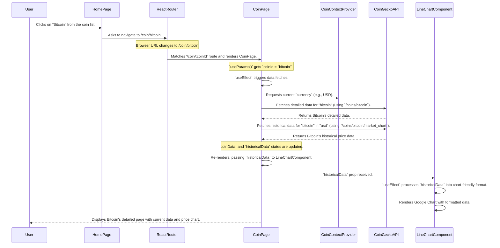

# Chapter 6: Coin Detail Page (Data & Charting)

Welcome back, future crypto investor! In our last chapter, [Home Page (Coin Listing & Search)](05_home_page__coin_listing___search__.md), we built the bustling market square of our `CoinPulse` app, where users can see a list of cryptocurrencies and search for their favorites. Now, what happens when a user spots an interesting coin like Bitcoin or Ethereum and wants to know *everything* about it?

This chapter is all about creating the **Coin Detail Page**. This page acts like a dedicated "investor's report" for a single cryptocurrency, giving you a deep dive into its current status and historical performance.

### The Big Problem: Getting a "Personalized Report" for a Coin

Imagine you're on the Home page, you see Bitcoin's price, and you want to understand its market cap, how its price changed in the last 24 hours, and most importantly, how its price has moved over the past week or month. Simply seeing a number isn't enough; you need context, trends, and all the nitty-gritty details.

This is the problem our **Coin Detail Page (Data & Charting)** solves. It's designed to provide:

1.  **Comprehensive Data**: All the important numbers for a specific coin, like its current price, market capitalization, and daily highs/lows.
2.  **Visual Trends**: A dynamic chart that shows the coin's price history, making it easy to spot trends and analyze performance over time.
3.  **A Focused View**: A page dedicated entirely to *one* coin, removing distractions.

Without this page, users wouldn't be able to properly research and understand individual cryptocurrencies, making it hard to make informed decisions.

### What is the Coin Detail Page? (The Individual Stock Report Analogy)

Think of our `CoinPulse` app's Home page as a general financial newspaper. The Coin Detail Page, on the other hand, is like getting a **full, in-depth stock report** for a single company you're very interested in.

*   You click on a company's name in the newspaper (our Home page).
*   You're immediately presented with a detailed document: its current stock price, how much the company is worth (market cap), its highest and lowest prices today, and most importantly, a graph showing its performance over the last few days, weeks, or months.

This detailed report helps you truly understand that specific asset.

### Key Ingredients of Our Coin Detail Page

Our Coin Detail Page (`src/pages/Coin/Coin.jsx`) brings together several concepts:

1.  **Identifying the Coin**: We need to know *which* coin the user clicked on. We use `react-router-dom`'s `useParams` hook for this, as introduced in [Chapter 3: Application Structure & Routing](03_application_structure___routing_.md).
2.  **Fetching Specific Data**: With the coin's ID, we make targeted requests to the [CoinGecko API Integration](01_coingecko_api_integration_.md) to get its detailed profile and historical price data.
3.  **Managing Loading States**: Fetching data takes time! We need to show a "Loading..." message or spinner to the user so they know something is happening.
4.  **Displaying Information**: We take the fetched data and present it clearly on the page (image, name, price, etc.).
5.  **Charting**: We use a dedicated `LineChart` component (which in turn uses the `react-google-charts` library) to turn historical price data into an interactive visual graph.

Let's dive into the code that makes this "investor's report" possible!

### Code Walkthrough: Building the Coin Detail Page (`src/pages/Coin/Coin.jsx`)

Open up `src/pages/Coin/Coin.jsx`.

#### 1. Importing What We Need

```javascript
// src/pages/Coin/Coin.jsx (simplified imports)
import React, {useContext, useEffect, useState } from 'react'
import './Coin.css' // Styling for our Coin Detail page
import { useParams } from 'react-router-dom' // To get coin ID from URL
import { CoinContext } from '../../context/CoinContext'; // To get current currency
import LineChart from '../../components/LineChart/LineChart'; // Our chart component
```

*   **`useParams`**: Crucial for knowing *which* coin's page we are on.
*   **`CoinContext`**: Our global bulletin board (from [Chapter 2: Global State Management (CoinContext)](02_global_state_management__coincontext__.md)) gives us the user's selected `currency`.
*   **`LineChart`**: A component we'll create to draw the historical price graph.

#### 2. Getting Coin ID and Setting Up Local State

```javascript
// src/pages/Coin/Coin.jsx (inside Coin component, simplified)
const Coin = () => {
    // 1. Get the dynamic part of the URL (e.g., 'bitcoin' from /coin/bitcoin)
    const {coinId} = useParams();

    // 2. Local state to store the detailed information of the coin
    const [coinData, setCoinData] = useState();
    // 3. Local state to store the historical price data for charting
    const [historicalData, setHistoricalData] = useState();

    // 4. Get the currently selected currency from our global state
    const {currency} = useContext(CoinContext);

    // ... rest of the component ...
};
```

*   **`useParams()`**: When a user clicks a coin on the Home page and navigates to `/coin/bitcoin`, `useParams()` gives us an object like `{ coinId: 'bitcoin' }`. We then "destructure" this to get `coinId`.
*   **`useState()` for `coinData`**: This will hold all the detailed information about the specific coin (image, name, price, market cap, etc.).
*   **`useState()` for `historicalData`**: This will hold the price data over time (e.g., daily prices for the last 10 days) needed to draw our chart.

#### 3. Fetching Coin Details (API Call)

```javascript
// src/pages/Coin/Coin.jsx (inside Coin component)
    // ... previous code ...

    const fetchCoinData = async () => {
        const options = {
            method: 'GET',
            headers: {accept: 'application/json', 'x-cg-demo-api-key': 'CG-AZCxCEDF4JoSCFw9pKVtMX8G'}
          };

          // This URL gets specific details for the `coinId` (e.g., 'bitcoin')
          fetch(`https://api.coingecko.com/api/v3/coins/${coinId}`, options)
            .then(res => res.json()) // Convert raw response to readable JSON
            .then(res => setCoinData(res)) // Store the detailed coin data
            .catch(err => console.error(err));
    }

    // ... rest of the component ...
```

*   **`fetchCoinData`**: This asynchronous function makes an API request to CoinGecko.
*   **`api.coingecko.com/api/v3/coins/${coinId}`**: This is the specific [CoinGecko API Integration](01_coingecko_api_integration_.md) endpoint to get all the rich details for a single cryptocurrency using its unique `coinId`.
*   **`.then(res => setCoinData(res))`**: Once the data arrives, we save it into our `coinData` state variable.

#### 4. Fetching Historical Price Data (API Call for Charts)

```javascript
// src/pages/Coin/Coin.jsx (inside Coin component)
    // ... previous code ...

    const fetchHistoricalData = async () => {
        const options = { /* same GET and API key options as before */ };

        // This URL gets historical market data for the `coinId`
        const url = `https://api.coingecko.com/api/v3/coins/${coinId}/market_chart?vs_currency=${currency.name}&days=10&interval=daily`;
        fetch(url, options)
            .then(res => res.json())
            .then(res => setHistoricalData(res)) // Store the historical data for the chart
            .catch(err => console.error(err));
    }

    // ... rest of the component ...
```

*   **`fetchHistoricalData`**: This function gets the data needed to draw our price chart.
*   **`api.coingecko.com/api/v3/coins/${coinId}/market_chart`**: This endpoint is specifically designed for historical price data.
*   **`vs_currency=${currency.name}`**: We tell CoinGecko to give us prices in the user's selected currency (e.g., USD, EUR).
*   **`days=10&interval=daily`**: These are important parameters for charts. They tell CoinGecko we want 10 days' worth of data, with one data point per day. You could change `days` to `30` for a monthly view, or `90` for a quarterly view, etc.
*   **`.then(res => setHistoricalData(res))`**: The fetched historical data is saved into our `historicalData` state.

#### 5. Triggering Data Fetches with `useEffect`

```javascript
// src/pages/Coin/Coin.jsx (inside Coin component)
    // ... previous code ...

    useEffect(() => {
        fetchCoinData();       // Fetch coin details
        fetchHistoricalData(); // Fetch chart data
    }, [currency, coinId]) // Re-run if currency or the coin we're looking at changes

    // ... rest of the component ...
```

*   **`useEffect`**: This React hook ensures that `fetchCoinData()` and `fetchHistoricalData()` are called when the `Coin` page first loads.
*   **`[currency, coinId]`**: This is the "dependency array". If the `currency` (from our global state) changes or if the `coinId` (from the URL, meaning we navigated to a *different* coin) changes, then `useEffect` will re-run its functions, fetching fresh data for the new currency or new coin.

#### 6. Handling Loading States (The Spinner)

Since fetching data takes time, we don't want to show an empty page.

```javascript
// src/pages/Coin/Coin.jsx (inside Coin component)
    // ... previous code ...

    if(coinData && historicalData){
        // Only render the coin data if both pieces of data have arrived
        return (
            <div className='coin'>
                {/* ... display coin details and chart here ... */}
            </div>
        )
    } else{
        // Otherwise, show a loading spinner
        return (
            <div className='spinner'>
                <div className='spin'></div>
            </div>
          )
    }
}
```

*   **`if(coinData && historicalData)`**: This conditional check ensures that our page only attempts to display content *after* both the detailed coin data and the historical chart data have successfully arrived from CoinGecko.
*   **`else { ... }`**: If either `coinData` or `historicalData` is still `undefined` (meaning the data hasn't arrived yet), we render a simple "spinner" (a small animated circle) to indicate to the user that content is loading. This is styled in `Coin.css`.

#### 7. Displaying the User Interface (JSX)

This is what the user actually sees: the coin's image, name, chart, and key financial metrics.

```javascript
// src/pages/Coin/Coin.jsx (simplified return statement when data is available)
        return (
          <div className='coin'>
              <div className="coin-name">
                  
                  <p><b>{coinData.name} ({coinData.symbol.toUpperCase()})</b></p>
              </div>

              <div className='coin-chart'>
                {/* Our LineChart component receives the historical data */}
                <LineChart historicalData={historicalData}/>
              </div>

              <div className='coin-info'> {/* Displays key metrics */}
                    <ul>
                        <li>Crypto Market Rank</li>
                        <li>{coinData.market_data.market_cap_rank}</li>
                    </ul>
                    <ul>
                        <li>Current Price</li>
                        <li>{currency.symbol} {coinData.market_data.current_price
                        [currency.name].toLocaleString()}</li>
                    </ul>
                    <ul>
                        <li>Market Cap</li>
                        <li>{currency.symbol} {coinData.market_data.market_cap
                        [currency.name].toLocaleString()}</li>
                    </ul>
                    <ul>
                        <li>24 Hour High</li>
                        <li>{currency.symbol} {coinData.market_data.high_24h
                        [currency.name].toLocaleString()}</li>
                    </ul>
                    <ul>
                        <li>24 Hour Low</li>
                        <li>{currency.symbol} {coinData.market_data.low_24h
                        [currency.name].toLocaleString()}</li>
                    </ul>
              </div>
          </div>
        )
```

*   **`coin-name`**: Displays the large image of the coin (`coinData.image.large`), its full `name`, and its `symbol` (e.g., "Bitcoin (BTC)").
*   **`coin-chart`**: This `div` is where our `LineChart` component lives. We pass the `historicalData` we fetched directly to it, and the `LineChart` component handles the rendering of the actual graph.
*   **`coin-info`**: This section uses `<ul>` (unordered lists) to display various financial metrics:
    *   `coinData.market_data.market_cap_rank`: The coin's rank in the crypto market.
    *   `coinData.market_data.current_price[currency.name]`: The current price in the selected currency.
    *   `coinData.market_data.market_cap[currency.name]`: The total market capitalization.
    *   `coinData.market_data.high_24h[currency.name]`: The highest price in the last 24 hours.
    *   `coinData.market_data.low_24h[currency.name]`: The lowest price in the last 24 hours.
*   **`toLocaleString()`**: This is a JavaScript function that formats numbers nicely with commas (e.g., 60000 becomes 60,000).
*   **`currency.symbol`**: We get the correct currency symbol ($, €, ₹) from our global `CoinContext` to display alongside the prices.

### Code Walkthrough: The Line Chart Component (`src/components/LineChart/LineChart.jsx`)

Our `LineChart` component is responsible for taking the raw historical data and turning it into a beautiful, interactive graph. It uses the `react-google-charts` library, which simplifies drawing various types of charts using Google Charts.

#### 1. Imports and Data Preparation

```javascript
// src/components/LineChart/LineChart.jsx (simplified)
import React, { useEffect, useState } from 'react'
import Chart from 'react-google-charts' // The charting library

const LineChart = ({historicalData}) => {
    // Local state to store the data in a format Google Charts understands
    const [data, setData] = useState([["Date", "Prices"]])

    useEffect(() => {
        let dataCopy = [["Date", "Prices"]]; // Initialize with headers
        if(historicalData.prices){ // Check if we actually have price data
            historicalData.prices.map((item) =>{
                // Each 'item' is [timestamp, price]. We convert timestamp to a readable date.
                dataCopy.push([`${new Date(item[0]).toLocaleDateString().slice(0,-5)}`, item[1]])
            })
            setData(dataCopy) // Update state with the formatted data
        }
    }, [historicalData]) // Re-run whenever historicalData changes from Coin.jsx
    // ... rest of the component ...
}
```

*   **`Chart from 'react-google-charts'`**: This is the component from the library that will draw our chart.
*   **`useState([["Date", "Prices"]])`**: Google Charts expects data as an array of arrays, with the first inner array being the column headers (like "Date" and "Prices").
*   **`useEffect(() => { ... }, [historicalData])`**: This hook watches for changes in `historicalData` (which is passed down from `Coin.jsx`). Whenever new historical data arrives, it processes it.
*   **`historicalData.prices.map((item) => { ... })`**: The `historicalData` we get from CoinGecko has a `prices` array, where each `item` is an array like `[timestamp, price]`. We loop through this array.
*   **`new Date(item[0]).toLocaleDateString().slice(0,-5)`**: This complex-looking line takes the `timestamp` (a long number representing a date and time) and converts it into a short, readable date string (e.g., "1/15"). `.slice(0,-5)` removes the year from the date for a cleaner look on the chart.
*   **`dataCopy.push(...)`**: For each price point, we add a new `[dateString, price]` array to our `dataCopy`.
*   **`setData(dataCopy)`**: Finally, we update our `data` state, which will cause the `Chart` component to re-render with the new data.

#### 2. Rendering the Chart

```javascript
// src/components/LineChart/LineChart.jsx (inside LineChart component)
    // ... previous code ...

  return (
    <Chart
    chartType='LineChart' // We want a line chart
    data={data}           // Our prepared data
    height="100%"         // Make it fill its container vertically
    legendToggle          // Allow users to show/hide the legend
    />
  )
}

export default LineChart
```

*   **`<Chart ... />`**: This is the component that draws the graph.
*   **`chartType='LineChart'`**: We specify that we want a line chart.
*   **`data={data}`**: We pass our specially formatted `data` state to the chart.
*   **`height="100%"`**: The chart will take up the full height of its parent container.
*   **`legendToggle`**: Adds a small checkbox that allows users to show or hide the chart's legend.

#### 3. Styling with `Coin.css` and `LineChart.css`

The `src/pages/Coin/Coin.css` file contains styling for the overall layout of the Coin Detail page, including the coin's name, the information lists, and the loading spinner. The `src/components/LineChart/LineChart.css` file is intentionally left empty in this project, as `react-google-charts` handles much of its own styling. The `coin-chart` div in `Coin.css` ensures the chart has a nice background and rounded corners.

### How it all Connects: A Deep Dive into a Coin

Let's trace what happens when a user clicks on Bitcoin from the Home page:



### Conclusion

In this chapter, we successfully built the **Coin Detail Page (Data & Charting)**, transforming raw API data into a comprehensive and interactive investor's report for individual cryptocurrencies. We leveraged:

*   `useParams` to identify the specific coin from the URL.
*   Targeted CoinGecko API calls (from [Chapter 1: CoinGecko API Integration](01_coingecko_api_integration_.md)) to fetch detailed coin data and historical prices.
*   `useEffect` to ensure data is fetched efficiently when the page loads or when the currency/coin changes.
*   Conditional rendering to display a loading spinner while data is being retrieved.
*   The `LineChart` component (using `react-google-charts`) to visualize historical price trends, making complex data easy to understand.

This page is a powerful tool for users to deep-dive into any cryptocurrency that catches their eye. With this, our `CoinPulse` application provides a complete journey from a market overview to granular coin analysis!

---